 

 

## Profile

I build production-grade software across the full stack — from interface design through backend architecture to deployment. My work spans web platforms, mobile applications, and real-time systems, with an emphasis on clean engineering and considered product design.

<table width="100%">
<tr>
<td width="25%" align="center">

**4+**
 
Shipped Products

</td>
<td width="25%" align="center">

**Full-Stack**
 
Web · Mobile · Backend

</td>
<td width="25%" align="center">

**Real-Time**
 
Messaging & Communication

</td>
<td width="25%" align="center">

**Product-Minded**
 
Engineering + Design

</td>
</tr>
</table>

 

## Technical Skills

<table width="100%">
<tr>
<td width="20%" valign="top"><strong>Frontend</strong></td>
<td width="80%">

</td>
</tr>
<tr>
<td width="20%" valign="top"><strong>Backend</strong></td>
<td width="80%">

</td>
</tr>
<tr>
<td width="20%" valign="top"><strong>Mobile</strong></td>
<td width="80%">

</td>
</tr>
<tr>
<td width="20%" valign="top"><strong>Tooling</strong></td>
<td width="80%">

</td>
</tr>
</table>

 

## Selected Work

<table width="100%">

<tr>
<th align="left" width="24%">Project</th>
<th align="left" width="42%">Description</th>
<th align="left" width="34%">Stack</th>
</tr>

<tr>
<td valign="top">

**RUBARU**
 
Social · Dating · Messaging

</td>
<td valign="top">

A social and dating platform combining discovery, messaging, presence, and audio/video communication into one product experience.

</td>
<td valign="top">

`React Native` `Node.js` `Express`
`MongoDB` `Socket.io` `Redis`

</td>
</tr>

<tr><td colspan="3"> </td></tr>

<tr>
<td valign="top">

**RUCHIKA CREATION**
 
Luxury Ethnicwear · E-Commerce

</td>
<td valign="top">

A premium e-commerce platform focused on refined presentation, intuitive product discovery, and a modern shopping journey.

</td>
<td valign="top">

`Next.js` `TypeScript` `React`
`Tailwind CSS`

</td>
</tr>

<tr><td colspan="3"> </td></tr>

<tr>
<td valign="top">

**RATIWAL DREAM ESTATES**
 
Real Estate · Lead Generation

</td>
<td valign="top">

A real-estate platform built around premium property presentation, discovery, lead capture, and business workflows.

</td>
<td valign="top">

`Next.js` `React` `TypeScript`
`MongoDB`

</td>
</tr>

<tr><td colspan="3"> </td></tr>

<tr>
<td valign="top">

**PARTHAV TECHNOLOGIES**
 
Technology · Digital Products

</td>
<td valign="top">

Digital product engineering focused on modern interfaces, practical business workflows, and maintainable, scalable code.

</td>
<td valign="top">

`TypeScript` `React` `Next.js`

</td>
</tr>

</table>

 

## Focus Areas

| Area | What it means for my work |
|:--|:--|
| **Web** | Modern, full-stack applications built for production, not prototypes |
| **Mobile** | React Native apps that feel native, not bolted-on |
| **Backend** | APIs, data models, and architecture that scale with the product |
| **Real-Time** | Messaging, presence, and live communication systems |
| **Product / UI-UX** | Interfaces and design systems built with intent |

 

## GitHub Activity

  

 

## Get in Touch

I'm always open to discussing new projects, collaborations, or product ideas worth building.

 

  

© Rahul Kumawat · Built with intent.

