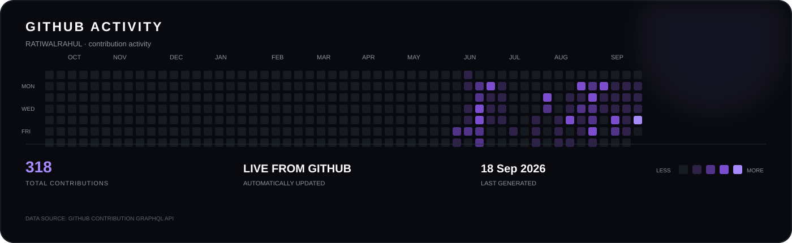

<div align="center">

# RAHUL KUMAWAT

### Full-Stack Developer · Product Builder · Creative Technologist

<br/>


<br/><br/>

<a href="https://github.com/RATIWALRAHUL">

</a>
&nbsp;
<a href="https://www.linkedin.com/in/ratiwalrahulkumawat">

</a>
&nbsp;
<a href="https://www.instagram.com/ratiwalrahul">

</a>

<br/><br/>


</div>

---

## `01` — PROFILE

<table width="100%">
<tr>

<td width="64%" valign="top">

### I build products, not just projects.

I'm **Rahul Kumawat**, a full-stack developer focused on turning ideas into polished, production-ready digital products.

I work across the complete product lifecycle:

**Product → UI/UX → Frontend → Backend → Database → Real-Time → Deployment**

I care about two things equally:

**How it works.**  
Clean architecture, reliable systems, maintainable code.

**How it feels.**  
Thoughtful interfaces, clear interactions, and polished experiences.

> Build with intent. Ship with purpose. Keep improving.

</td>

<td width="36%" valign="top">

### CURRENT STACK

**Frontend**

`React`  
`Next.js`  
`TypeScript`

**Backend**

`Node.js`  
`Express`  
`MongoDB`

**Real-Time**

`Socket.io`  
`Redis`

**Mobile**

`React Native`  
`Android`

**Design**

`Figma`

</td>

</tr>
</table>

---

## `02` — WHAT I BUILD

<div align="center">

<table width="100%">
<tr>

<td width="33%" valign="top">

### ◈ PRODUCT

Digital products designed around real users and real workflows.

<br/>

`Web Apps`

`Mobile Apps`

`E-Commerce`

`SaaS`

</td>

<td width="33%" valign="top">

### ◎ ENGINEERING

Systems that are built to support the product beyond the first release.

<br/>

`APIs`

`Databases`

`Authentication`

`Architecture`

</td>

<td width="33%" valign="top">

### ≋ REAL-TIME

Experiences where communication needs to happen instantly.

<br/>

`Messaging`

`Presence`

`Notifications`

`Audio / Video`

</td>

</tr>
</table>

</div>

---

## `03` — SELECTED WORK

<table width="100%">

<tr>

<td width="50%" valign="top">

### 🟣 RUBARU

**Social · Dating · Messaging · Calling**

A social and dating platform combining discovery, messaging, presence, and audio/video communication into one product experience.

**Built with**

`React Native` · `Node.js`  
`Express` · `MongoDB`  
`Socket.io` · `Redis`

</td>

<td width="50%" valign="top">

### 🟠 RUCHIKA CREATION

**Luxury Ethnicwear · E-Commerce**

A premium e-commerce experience focused on refined presentation, intuitive product discovery, and a modern shopping journey.

**Built with**

`Next.js` · `TypeScript`  
`React` · `Tailwind CSS`

</td>

</tr>

<tr>
<td colspan="2"><br/></td>
</tr>

<tr>

<td width="50%" valign="top">

### 🔵 RATIWAL DREAM ESTATES

**Real Estate · Property Discovery**

A modern real-estate platform built around premium property presentation, discovery, lead generation, and business workflows.

**Built with**

`Next.js` · `React`  
`TypeScript` · `MongoDB`

</td>

<td width="50%" valign="top">

### ⚡ PARTHAV TECHNOLOGIES

**Technology · Digital Products**

Digital product engineering focused on modern interfaces, practical business workflows, and maintainable code.

**Built with**

`TypeScript` · `React`  
`Next.js`

</td>

</tr>

</table>

<br/>

<div align="center">

<a href="https://github.com/RATIWALRAHUL?tab=repositories">

</a>

</div>

---

## `04` — TECHNOLOGY

<div align="center">

### FRONTEND


<br/><br/>

### BACKEND & DATABASE


<br/><br/>

### MOBILE & TOOLS


</div>

---

## `05` — HOW I APPROACH PRODUCTS

<table width="100%">

<tr>

<td width="25%" align="center">

### `01`

**DISCOVER**

Understand the problem, users, and product goal.

</td>

<td width="25%" align="center">

### `02`

**DESIGN**

Shape the experience before writing unnecessary code.

</td>

<td width="25%" align="center">

### `03`

**BUILD**

Create the frontend, backend, data, and real-time systems.

</td>

<td width="25%" align="center">

### `04`

**SHIP**

Test, deploy, observe, iterate, and improve.

</td>

</tr>

</table>

---

## `06` — GITHUB ACTIVITY

<div align="center">



</div>

---

## `07` — GITHUB SNAPSHOT

<div align="center">

<table>

<tr>

<td align="center">

### BUILDING

**4+**

<sub>Selected Products</sub>

</td>

<td width="30"></td>

<td align="center">

### FOCUS

**FULL-STACK**

<sub>Web · Mobile · Backend</sub>

</td>

<td width="30"></td>

<td align="center">

### SYSTEMS

**REAL-TIME**

<sub>Messaging · Calling · Presence</sub>

</td>

</tr>

</table>

</div>

<br/>

<div align="center">

<a href="https://github.com/RATIWALRAHUL?tab=overview">

</a>

</div>

---

## `08` — CURRENT FOCUS

```text
┌─────────────────────────────────────────────────────────────┐
│                                                             │
│  PRODUCT ENGINEERING                                        │
│  Building complete products from interface to production.  │
│                                                             │
│  REAL-TIME SYSTEMS                                          │
│  Messaging · Presence · Notifications · Live Communication  │
│                                                             │
│  MOBILE EXPERIENCES                                         │
│  React Native applications with native-quality UX.          │
│                                                             │
│  PRODUCT UI / UX                                             │
│  Interfaces designed with clarity, hierarchy, and intent.   │
│                                                             │
└─────────────────────────────────────────────────────────────┘
```

---

## `09` — CONNECT

<div align="center">

### Have an idea worth building?

I'm always interested in interesting products, collaborations, and ambitious ideas.

<br/>

<a href="https://www.linkedin.com/in/ratiwalrahulkumawat">

</a>

&nbsp;

<a href="https://www.instagram.com/ratiwalrahul">

</a>

<br/><br/>

<sub>Rahul Kumawat · India</sub>

<br/>

<sub>BUILD · SHIP · ITERATE</sub>

</div>

---

<div align="center">

<sub>© Rahul Kumawat · Built with intent.</sub>

</div>
